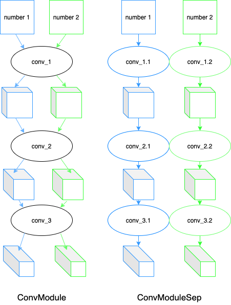
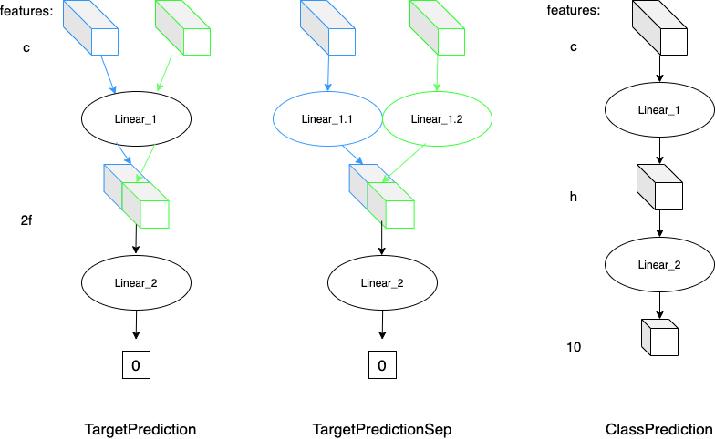
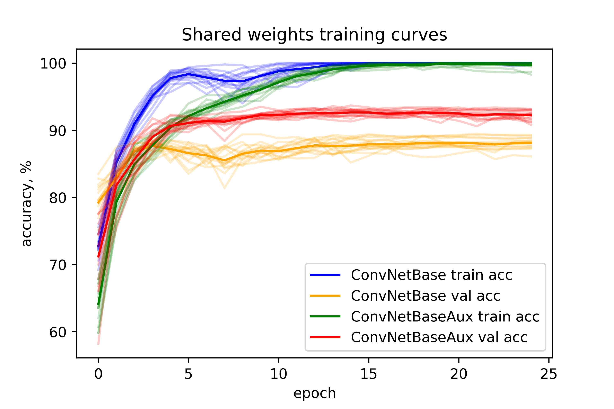
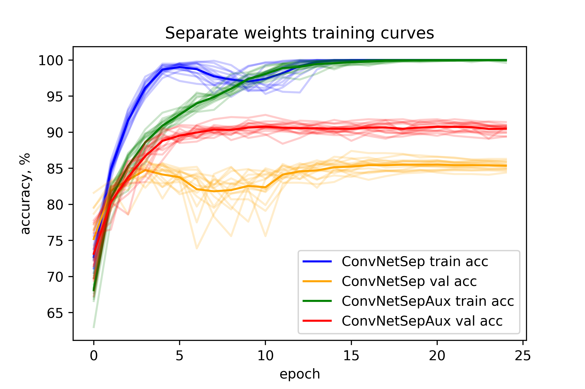
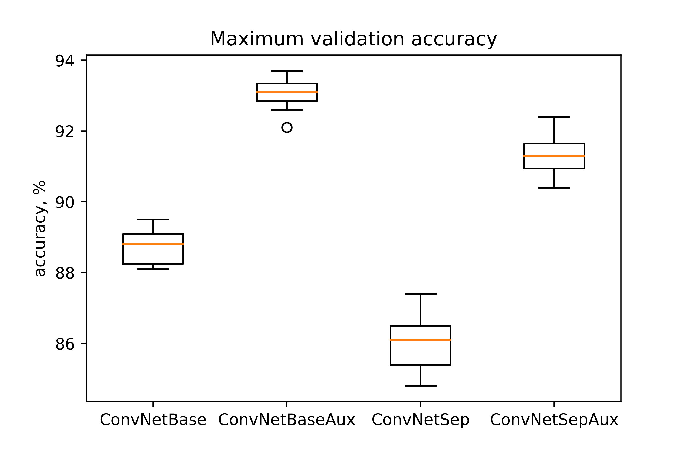

# EE-559: miniproject 1
*Elizaveta Kozlova, Sergey Klyavinek*

28.05.2021

## Introduction
### Goal
The goal of this project was stated as comparison of different architectures. 
In particular, the focus was placed on the introduction of auxillary losses and weight sharing.

### Data
Our dataset consisted of pairs of 14 x 14 images of MNIST handwritten numbers. The goal was to classify those pairs
as 'greater' or 'smaller', depending on which of the two numbers was larger. We were also provided with 
classes for all the images. Altogether we had 1000 pairs in the training dataset and 
1000 in the test dataset.

### Strategy
Since the goal was to compare different architectures rather than to reach the highest 
metric, we have decided to implement a few simple convolutional networks,
They are fast to train and easy to see the differences on.

## Methods
Altogether we wrote four different architectures: `ConvNetBase`, `ConvNetSep`, `ConvNetBaseAux`
and `ConvNetSepAux`. The 'Aux' suffix means that the architecture utilizes an auxillary loss (class prediction for the 
numbers).
'Base' and 'Sep' means shared or not shared weights, respectively. All those models are a 
combination of four modules: `ConvModule`, `ConvModuleSep`, `TargetPrediction`, `TargetPredictionSep` 
and `ClassPrediction`.

The convolutional modules were used for feature extraction. 

Those features were then fed into fully connected 
classification modules. `TargetPrediction` and `TargetPredictionSep` predict the target variable (greater or smaller) 
while the `ClassPrediction` module predicts the class of the images (the numbers). 

 
On the illustrations the number of features is highlighted at each layer. In most cases it is denoted with 
variables: **c**, **h** and **f**. Those are hyperparameters that had to be optimized.
The actual architecture we used differs in that convolutional modules are followed by a dropout layer 
and every convolutional layer is optionally followed by a batch normalization layer.  

The loss functions we used are binary cross-entropy (`nn.BCELoss()`) for the main classification task 
and regular cross-entropy (`nn.CrossEntropyLoss()`) for the auxillary task. 

Even though those architectures are purposefully chosen to be simple, they still have a number of hyperparameters. 
For the networks without the `ClassPredictionModule` those are **c**, **f**, learning rate, dropout rate and 
usage of batch normalization. Networks that do utilize the auxillary loss have two additional hyperparameters: **h** and
the weight of the auxillary loss. For the sake of fair comparison, those hyperparameters were roughly tuned on a large number of 
10-epoch runs with different parameters. 
Since the differences between the architectures are minor, we tuned the common hyperparameters on `ConvNetBase` and the 'auxillary' 
plus the learning rate for `ConvNetBaseAux`. They were then applied to all networks. The reason why we optimized the learning rate 
separately for the two classes is that with large auxillary loss weights the optimal learning rate can change significantly.

## Results
As could be expected, sharing weights for the two numbers as well as adding an auxillary loss had a significant positive 
influence on the classification accuracy. Here you can see the training and validation learning curves for all networks.
The transparent lines are the 15 runs we did in each experiment and the bold ones are the epoch-wise mean.

 

After running the experiments we analyzed the maximum validation accuracy reached in each run. 
The models reached 88.71 ± 0.48, 93.06 ± 0.41, 86.00 ± 0.72 and 91.33 ± 0.50 percent for `ConvNetBase`, `ConvNetBaseAux`, 
`ConvNetSep` and `ConvNetSepAux`, respectively. Those results are represented in the following boxplot. 

## Discussion
As we mentioned in the previous section, the fact that auxillary losses and weight sharing are beneficial 
could be anticipated.
The reason for that is that both those methods provide additional information to the module.
In the case of the auxillary loss, that information is explicitly passed as the number labels whereas with weight sharing, 
it is a little less obvious. It is still, however, the same thing in essence, since the shared layers are trained on twice 
the amount of data as separate layers.
And 'more information leads to better trained models' is a general prnciple that always holds.